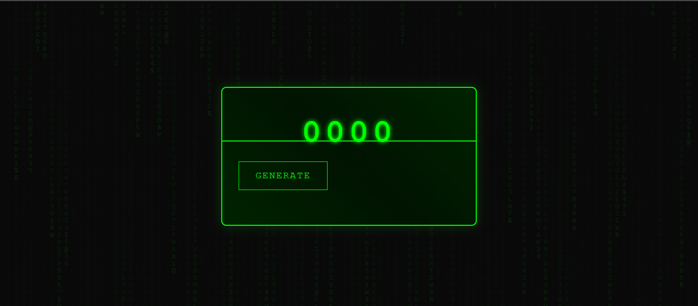
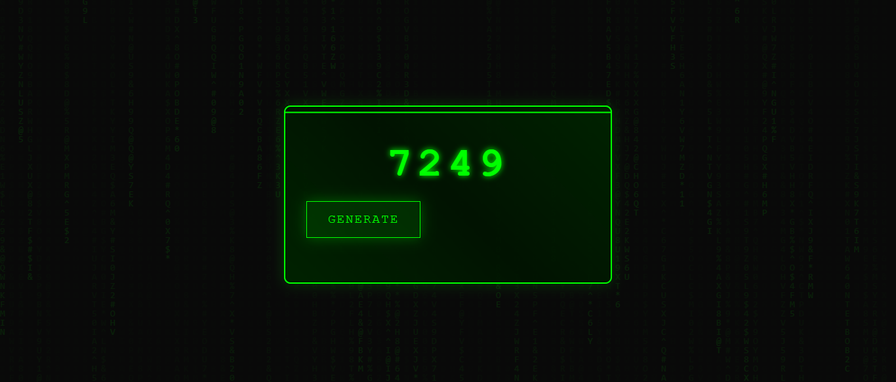
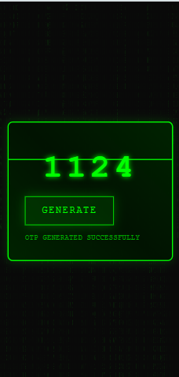

# 🔐 Cyberpunk OTP Generator

A stylish, animated One-Time Password (OTP) generator with a cyberpunk/hacker aesthetic. This project features dynamic Matrix-style animations, sleek UI elements, and smooth generation effects.



## ✨ Features

- 🎯 Generate random 4-digit OTP codes
- 🎨 Cyberpunk-themed dark UI with glowing effects
- 🌧️ Animated Matrix-style background
- ⌨️ Type-writer effect during OTP generation
- 📱 Fully responsive design
- 🔄 Scramble animation during generation
- ⚡ Real-time status updates

## 🛠️ Technologies Used


## 🚀 Quick Start

1. **Clone the repository**
   ```bash
   git clone https://github.com/harshalnalkar/cyberpunk-otp-generator.git
   ```

2. **Navigate to project directory**
   ```bash
   cd cyberpunk-otp-generator
   ```

3. **Project Structure**
   ```
   cyberpunk-otp-generator/
   ├── index.html
   ├── style.css
   ├── script.js
   ├── README.md
   ├── LICENSE
   ├── images/
   │   ├── banner.png
   │   ├── main-interface.png
   │   ├── otp-animation.png
   │   └── mobile-view.png
   ```

4. **Open in browser**
   - Simply open `index.html` in your preferred web browser
   - Or use a local development server:
     ```bash
     python -m http.server 8000
     # Then visit http://localhost:8000
     ```

## 📸 Screenshots

### Main Interface


### OTP Generation Animation


### Responsive Mobile View


## 💻 Usage

1. Open the application in your web browser
2. Click the "GENERATE" button to create a new OTP
3. Watch the animated generation process
4. Your new 4-digit OTP will be displayed with a typing effect
5. Status messages will appear below the generator

## 🎨 Customization

### Changing Colors
```css
:root {
    --primary-color: #00ff00;   
    --bg-color: #0a0a0a;       
    --border-color: #00ff00;     
}
```

### Modifying OTP Length
```javascript
function generateOTP(length = 4) {
    const digits = '0123456789';
    let otp = '';
    for (let i = 0; i < length; i++) {
        otp += digits[Math.floor(Math.random() * 10)];
    }
    return otp;
}
```

## 🤝 Contributing

1. Fork the repository
2. Create your feature branch (`git checkout -b feature/AmazingFeature`)
3. Commit your changes (`git commit -m 'Add some AmazingFeature'`)
4. Push to the branch (`git push origin feature/AmazingFeature`)
5. Open a Pull Request

## 📝 License

This project is licensed under the MIT License - see the [LICENSE](LICENSE) file for details.

```
MIT License

Copyright (c) 2024 Harshal Nalkar

Permission is hereby granted, free of charge, to any person obtaining a copy
of this software and associated documentation files (the "Software"), to deal
in the Software without restriction, including without limitation the rights
to use, copy, modify, merge, publish, distribute, sublicense, and/or sell
copies of the Software, and to permit persons to whom the Software is
furnished to do so, subject to the following conditions:

The above copyright notice and this permission notice shall be included in all
copies or substantial portions of the Software.

THE SOFTWARE IS PROVIDED "AS IS", WITHOUT WARRANTY OF ANY KIND, EXPRESS OR
IMPLIED, INCLUDING BUT NOT LIMITED TO THE WARRANTIES OF MERCHANTABILITY,
FITNESS FOR A PARTICULAR PURPOSE AND NONINFRINGEMENT. IN NO EVENT SHALL THE
AUTHORS OR COPYRIGHT HOLDERS BE LIABLE FOR ANY CLAIM, DAMAGES OR OTHER
LIABILITY, WHETHER IN AN ACTION OF CONTRACT, TORT OR OTHERWISE, ARISING FROM,
OUT OF OR IN CONNECTION WITH THE SOFTWARE OR THE USE OR OTHER DEALINGS IN THE
SOFTWARE.
```

## 👨‍💻 Author

Harshal Nalkar - [@harshalnalkar](https://github.com/harshalnalkar)

## 🌟 Acknowledgments

- Inspired by cyberpunk aesthetics and classic hacker interfaces
- Matrix digital rain animation adapted from various open-source implementations
- Special thanks to the open-source community

## 📧 Contact

- GitHub: [@harshalnalkar](https://github.com/harshalnalkar)
- Email: harshalnalkar5@gmail.com

---

⭐ Star this repository if you find it helpful!

